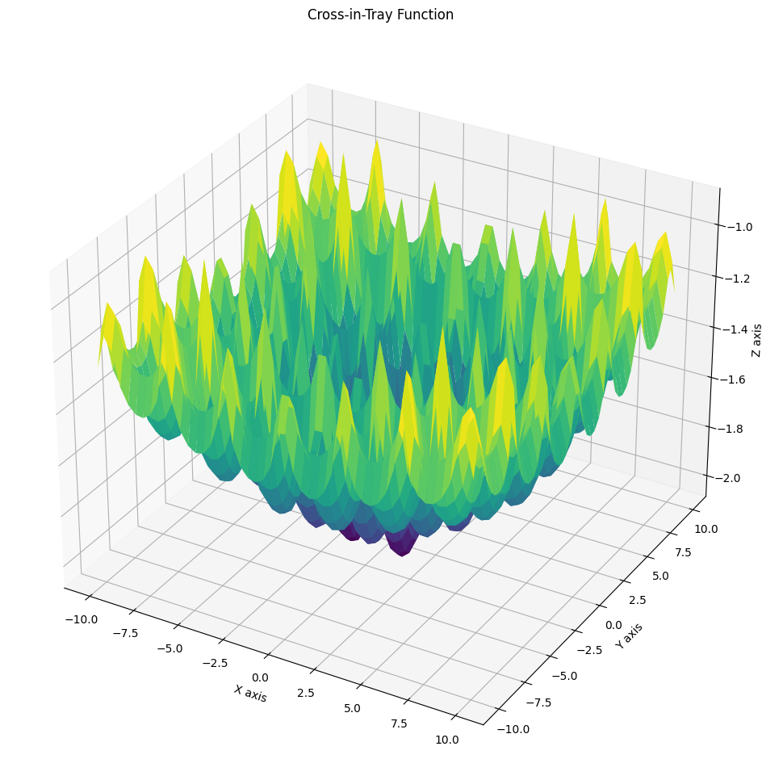
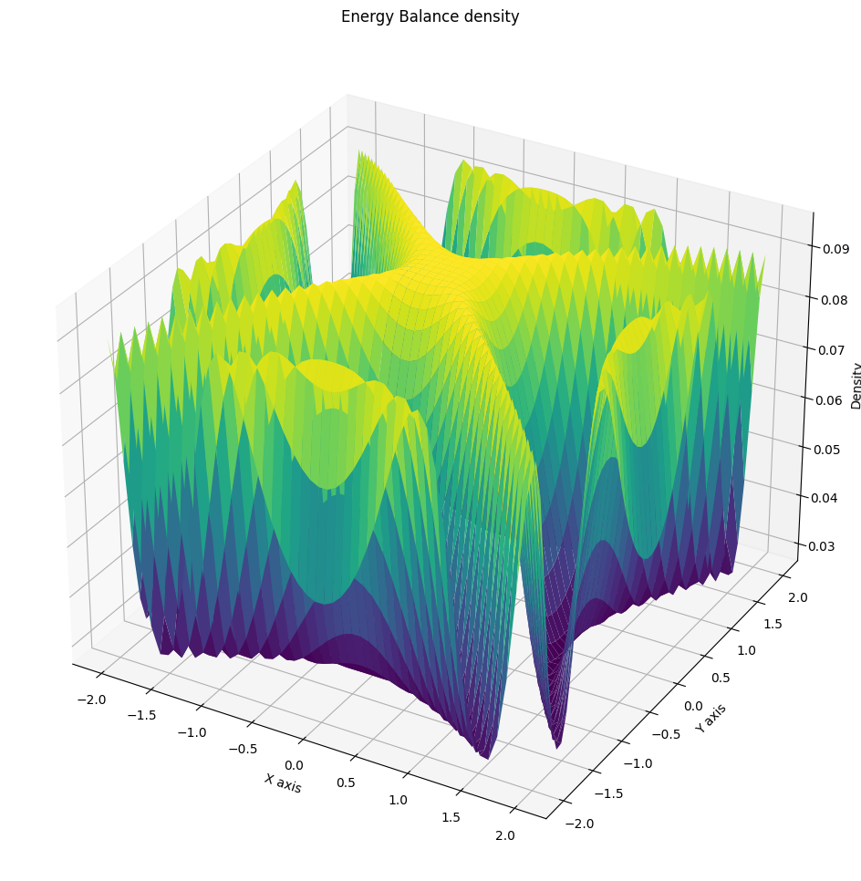
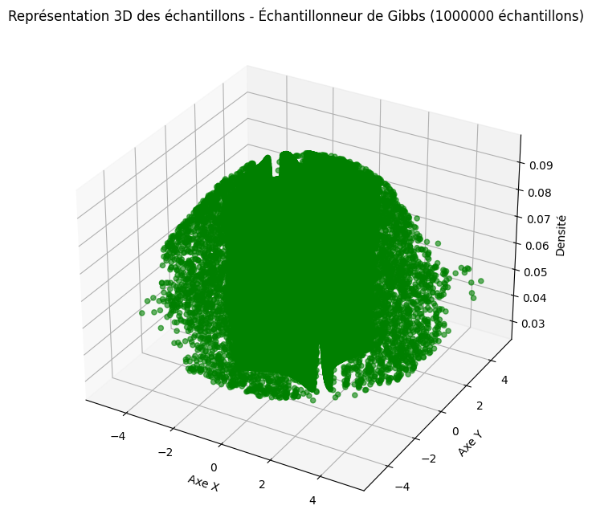

# Algorithmes d'optimisation stochastique

Cinq familles de méthodes pour chercher le minimum d'une fonction, comparées d'abord sur une fonction test dont on connaît la réponse, puis sur une fonction plus difficile.

## Les méthodes

| Méthode | Principe |
| --- | --- |
| **Descente de gradient** | Suit la pente. Rapide et fiable sur une fonction convexe, piégée au premier creux venu sinon. Sert ici de référence. |
| **Échantillonneur de Gibbs** | Met à jour une coordonnée à la fois, conditionnellement aux autres. Contourne le problème de la dimension en le découpant. |
| **Recuit simulé** | Accepte parfois de faire pire, avec une probabilité qui décroît au fil des itérations. C'est ce qui lui permet de ressortir d'un minimum local. |
| **Algorithme génétique** | Fait évoluer une population de solutions par sélection, croisement et mutation. Explore plusieurs régions à la fois. |
| **Heuristique** | Une règle adaptée au problème, sans garantie théorique mais souvent efficace en pratique. |

## L'enjeu de la comparaison

Sur une fonction test bien choisie, l'optimum est connu : on peut donc mesurer non seulement la qualité de la solution trouvée, mais aussi le nombre d'évaluations nécessaires pour y parvenir. C'est cette seconde métrique qui départage réellement les méthodes — toutes finissent par trouver quelque chose, la question est à quel coût.

Le passage à une fonction plus complexe révèle ensuite la vraie différence : les méthodes purement locales s'arrêtent au premier minimum rencontré, les méthodes stochastiques continuent d'explorer.







## Contenu du dépôt

| Fichier | Rôle |
| --- | --- |
| `stochastic_optimization.ipynb` | Implémentations, tests et comparaisons |
| `assets/` | Figures extraites du carnet |

## Exécution

```bash
pip install numpy matplotlib scipy jupyter
jupyter notebook stochastic_optimization.ipynb
```

## Ce qu'il faut retenir

Aucune de ces méthodes ne domine les autres. Le choix dépend de ce qu'on sait de la fonction : convexe et dérivable, le gradient est imbattable ; accidentée et coûteuse à évaluer, une méthode stochastique devient préférable malgré son absence de garantie.

Et dans tous les cas, ces algorithmes ont leurs propres réglages — température, taux de mutation, pas d'apprentissage — dont dépend largement le résultat. Optimiser une fonction demande souvent d'optimiser d'abord son optimiseur.
